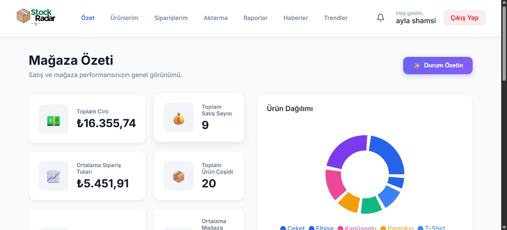
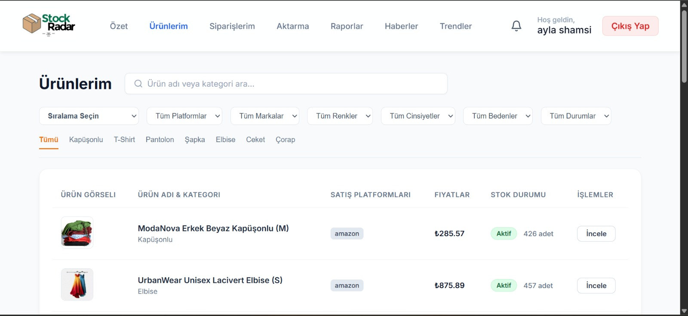
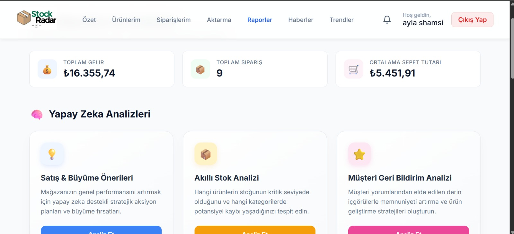
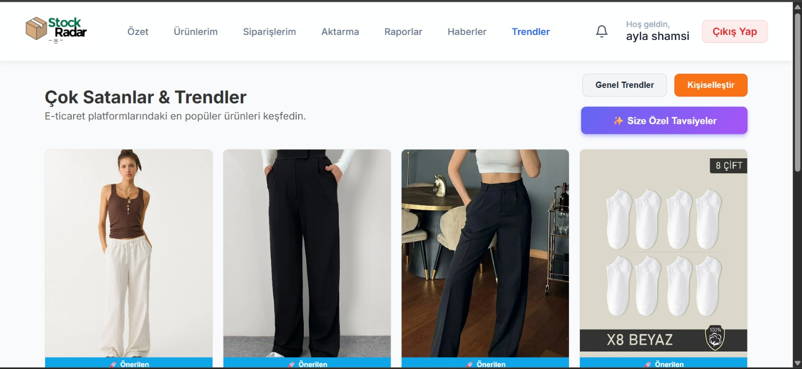
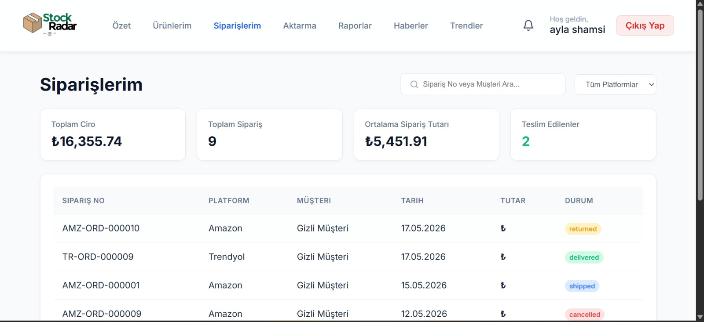

# StockRadar (AI-powered Seller Intelligence Platform/Dashboard)

AI-powered inventory intelligence and seller analytics dashboard designed for fashion e-commerce businesses.

The platform helps online sellers monitor products, analyze sales performance, detect market trends, and receive AI-driven business recommendations across multiple marketplaces.

---

## Overview

This project is being developed during a BTK hackathon as a smart analytics platform for fashion sellers.

The system combines:

- Multi-channel marketplace integration
- Product and sales analytics
- AI-generated business summaries
- Trend detection and monitoring
- Inventory intelligence
- Review analysis
- Smart seller recommendations
- Automated synchronization system
- Inventory and return monitoring
- Market intelligence alerts

---

## Main Features

### Multi-Platform Integration

Simulated integrations for:
- Trendyol
- Hepsiburada
- Amazon

The system architecture supports future real API integrations.

---

### Connected Accounts

Users can connect marketplace accounts using API-key based mock integrations.

Each connected account supports:

- Platform-based account linking
- Source user identification
- Manual synchronization
- Last sync tracking
- Account activation/deactivation
- Multi-account management

---

### Product Monitoring & Analytics

Track product performance across multiple platforms:
- Product listing management
- Sales performance tracking
- Inventory monitoring
- Return monitoring
- Ratings and reviews analytics
- Platform-based product comparison

---

### AI Report Summaries

The platform converts complex seller data into simple business insights using LLM-powered analysis.

AI-generated reports include:

- Sales summaries
- Product performance analysis
- Inventory analysis
- Review insights
- Business recommendations

---

### AI Cache System

StockRadar includes a hash-based AI caching mechanism to avoid unnecessary LLM requests.

If the report data has not changed, the system reuses the previously generated AI response instead of sending a new request to the LLM.

This improves:

- Response speed
- Token efficiency
- System performance
- Cost optimization

---

### Trend Engine

Detects rising fashion trends and matches them with seller inventory.

Features include:

- Trending product detection
- Trend-based recommendations
- Market opportunity analysis
- Fashion trend monitoring

---

### Review Intelligence

Analyzes customer reviews to identify:

- Negative feedback patterns
- Size-related issues
- Shipping complaints
- Product quality insights
- Customer sentiment

---

### Market News & Intelligence

Aggregates fashion and e-commerce related news and summarizes them into seller-focused insights and alerts.

The system generates:

- Market alerts
- Trend alerts
- Opportunity notifications
- Industry intelligence summaries

---

### Smart Recommendations

Provides actionable AI suggestions such as:
- Increase stock
- Promote trending products
- Optimize pricing strategy
- Improve size charts
- Expand product categories

---

### Sync Engine

Supports:

- Manual synchronization
- Scheduled synchronization
- Multi-platform data refresh
- Import tracking
- Sync logging system
- Connected account management

---

### Alerts & Notifications

Generates intelligent alerts for:

- Stock risks
- Trend opportunities
- Return issues
- Negative reviews
- Market changes
- Platform activity

---

### Admin Management

Includes admin monitoring tools for:

- User management
- Connected account tracking
- AI cache management
- Platform activity monitoring
- System analytics

 ---
  
## Tech Stack

### Frontend
- React
- Vite

### Backend

- Python
- FastAPI
- SQLAlchemy
- JWT Authentication
- APScheduler

### Database

- PostgreSQL


### Infrastructure

- Docker
- Docker Compose

### Data Layer

- Marketplace simulation engine
- JSON-based marketplace mock sources
- Multi-platform mock integration system

### AI Layer

- Gemini-powered report summarization(Gemini 2.5 Flash)
- AI-generated recommendations
- Trend analysis engine
- Review sentiment analysis
- Inventory intelligence system

---

## System Architecture

```text
Frontend (React + Vite)
        ↓
FastAPI Backend
        ↓
Router Layer
        ↓
Service Layer
        ↓
PostgreSQL Database

AI Layer:
- Gemini API
- AI Report Summaries
- AI Recommendations
- AI Review Analysis
- AI Stock Analysis
- AI Cache System

Marketplace Simulation:
- JSON mock sources
- API-key based account matching
- Product, order and review imports


## Installation

### Clone the project

```bash
git clone <repository_url>
cd project
```

---

### Create environment variables

```bash
cp .env.example .env
```

Fill the required API keys inside `.env`.

---

### Start the system

```bash
docker compose up --build
```

---

### Generate marketplace mock data

After the containers are running:

```bash
docker compose exec backend python scripts/generate_mock_data.py
```

---

## Security

- JWT-based authentication
- Protected API routes
- Role-based admin authorization
- User-based marketplace isolation
- Connected account validation
- API-key based mock marketplace connection

---

## Admin User Setup

Admin users are created using a seed script.

After the containers are running, open a new terminal and run:

```bash
docker compose exec backend python scripts/create_admin.py
```

The script creates an admin user in the database.

Admin users can access protected admin routes such as:

```text
/admin/users
/admin/summary
/admin/ai-cache
/admin/connected-accounts
/admin/listings
/admin/users/{user_id}
/admin/users/{user_id}/products/nested
```

Admin access is controlled by role-based authorization.

Normal sellers cannot access admin endpoints.

---

## API Documentation

FastAPI Swagger documentation is available at:

```text
http://localhost:8000/docs
```

---

## Demo Flow

1. Create or login as a seller.
2. Connect a marketplace account using an API key.
3. Import product, order and review data.
4. View inventory and sales analytics.
5. Generate AI-powered reports.
6. Review market news and trend insights.
7. Use admin panel for system monitoring.

---

## Screenshots

### Dashboard


### Product Analytics


### AI Reports


### Trends


### Order Analytics


---

## Future Improvements

- Real marketplace API integrations
- Mobile application
- AI pricing optimization
- Seller performance scoring system
- Multi-language support

---

## Team

Developed by EastCoders.

Taha Buğra KÜÇÜKENEZ
Ayla Shamsi
Emrullah Gülseven
